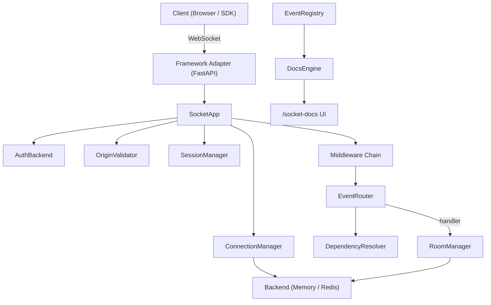

# Architecture

This page describes the internal design of SocketSpec: how components are organized, how a message flows from client to handler, and where extension points exist.

---

## Design Philosophy

SocketSpec is built on three principles:

1. **Convention over configuration.** Sensible defaults for authentication, rate limiting, session management, and error handling. Override only what you need.
2. **Framework independence.** The core library has no dependency on FastAPI, Starlette, or any web framework. Adapters bridge the gap through a minimal `RawSocket` protocol.
3. **Observable by default.** Every registered event automatically generates documentation metadata. The interactive UI is not an afterthought -- it is a first-class output of the event registration system.

---

## Component Overview



---

## Core Components

### SocketApp

The central orchestrator. `SocketApp` owns the event registry, connection manager, room manager, session manager, and middleware chain. It exposes the decorator API (`@socket.on`, `@socket.on_connect`, `@socket.middleware`) and the three entry points that adapters call: `handle_connect`, `handle_event`, and `handle_disconnect`.

### EventRegistry

Stores all registered event handlers along with their metadata: event name, description, tags, Pydantic payload model, emits/broadcasts declarations, and deprecation status. The registry is frozen at startup after `_startup_validate()` confirms there are no duplicate event names or reserved-name collisions.

### EventRouter

Dispatches inbound messages to their registered handler. The router resolves dependencies via `DependencyResolver`, runs the middleware chain, validates the payload against the Pydantic model, and catches handler exceptions to emit structured `HANDLER_ERROR` envelopes.

### ConnectionManager

Tracks all active connections. Each connection is identified by a UUID and stored in the backend. The manager provides `connect()`, `disconnect()`, `get()`, and `broadcast()` operations.

### RoomManager

Manages named rooms with join, leave, broadcast, and membership queries. Supports pattern-based guards (`"admin:{section}"`) that extract path variables and pass them to guard functions. Room joins are atomic: if a lifecycle hook raises an exception, the join is rolled back.

### SessionManager

Monitors connection health through heartbeat ping/pong, idle timeout detection, max session duration enforcement, and JWT token refresh warnings. Each connection gets an independent session task.

### DependencyResolver

Resolves `Depends()` parameters in handler signatures using an `AsyncExitStack` for cleanup. Supports nested dependencies and generator-based teardown.

### Backend (Memory / Redis)

The storage layer for connections and pub/sub. The default `MemoryBackend` stores everything in-process. A Redis backend can be plugged in for multi-process deployments.

---

## Request Lifecycle

When a client sends a WebSocket message, it passes through the following stages:

```
1. Adapter receives raw WebSocket frame
   |
2. JSON parse
   |-- Failure --> VALIDATION_ERROR sent to client
   |
3. Payload size check
   |-- Exceeds limit --> PAYLOAD_TOO_LARGE sent to client
   |
4. Rate limit check
   |-- Bucket exhausted --> RATE_LIMIT_ERROR sent to client
   |
5. Session activity update (touch last_active timestamp)
   |
6. System event check (__pong__ handled internally, not routed)
   |
7. Middleware chain (FIFO order)
   |
8. Pydantic payload validation against registered model
   |-- Failure --> VALIDATION_ERROR sent to client
   |
9. Dependency injection resolution
   |
10. Handler execution
    |-- Exception --> HANDLER_ERROR sent to client (connection survives)
```

At every failure point, the client receives a structured error envelope. The connection is never terminated due to a handler or validation error.

---

## Connection Lifecycle

```
1. WebSocket handshake (handled by framework adapter)
   |
2. Origin validation
   |-- Rejected --> Connection closed with code 4003
   |
3. Authentication (if AuthBackend configured)
   |-- Failed --> AUTH_ERROR sent, connection closed with code 4001
   |
4. Connection registered in ConnectionManager
   |
5. Session task started (heartbeat, idle timeout, max duration)
   |
6. on_connect hooks fire
   |
7. Message receive loop (steps from Request Lifecycle above)
   |
8. Connection closes (client disconnect, timeout, or server shutdown)
   |
9. on_disconnect hooks fire
   |
10. Connection removed from all rooms
    |
11. Connection deregistered from ConnectionManager
    |
12. Session task cancelled
```

---

## Extension Points

| Extension | Mechanism | Documentation |
|---|---|---|
| Custom authentication | Implement `AuthBackend` protocol | [Security Guide](../how-to/security.md) |
| Custom middleware | `@socket.middleware` decorator | [Middleware Guide](../how-to/middleware.md) |
| Custom dependencies | `Depends()` in handler signature | [Dependency Injection Guide](../how-to/dependency-injection.md) |
| Custom storage backend | Implement `BackendAdapter` protocol | [Writing a New Adapter](../contributing/new-adapter.md) |
| Room access control | `@socket.room_guard("pattern")` | [Rooms Tutorial](../tutorial/rooms.md) |
| Lifecycle hooks | `@socket.on_connect`, `@socket.on_disconnect`, `@socket.on_error` | [SocketApp Reference](../reference/socketapp.md) |

---

## Wire Protocol

SocketSpec uses a simple JSON envelope for all messages. See the [Wire Protocol](wire-protocol.md) page for the complete specification.
